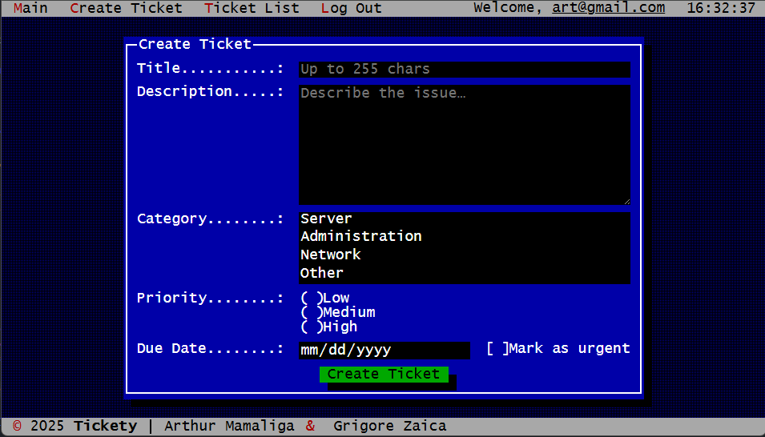
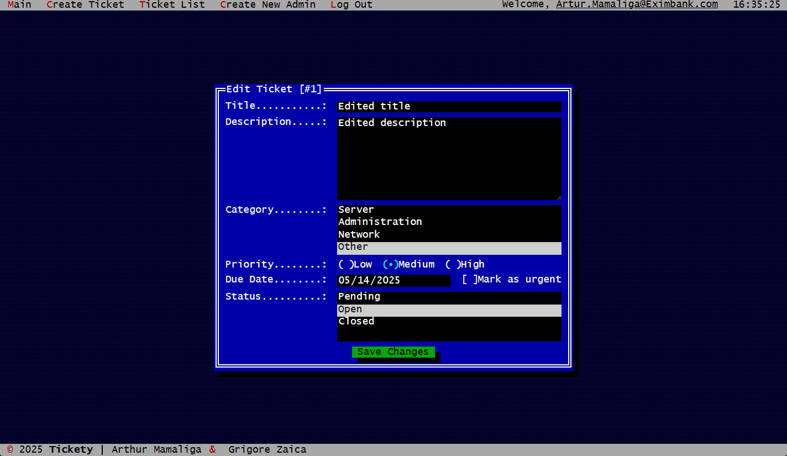
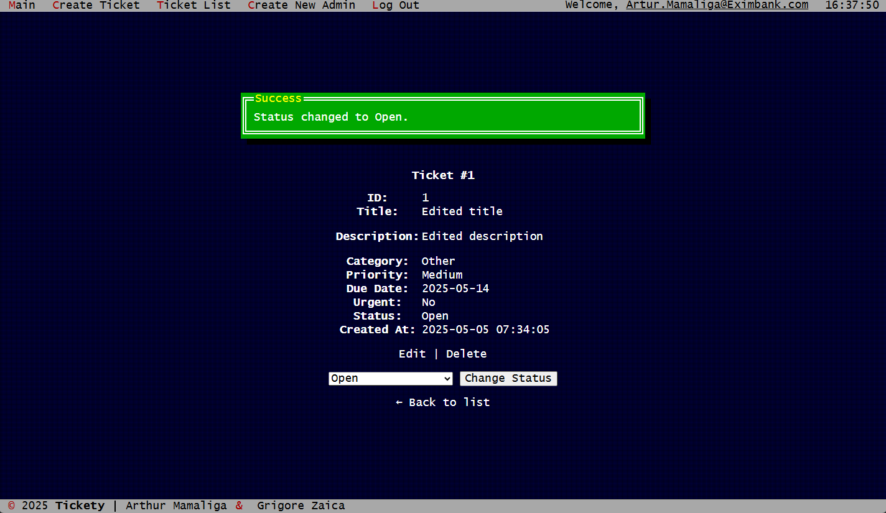

# Отчет по лабораторной работе: система управления тикетами

## 1. Введение

В данном отчете представлена информация о разработанном веб-приложении — системе управления тикетами. Приложение реализовано на чистом PHP с использованием Docker для контейнеризации и MySQL в качестве СУБД.

## 2. Инструкции по запуску проекта

1. Клонировать репозиторий:

   ```bash
   git clone https://github.com/slendchat/php_individual_work.git
   cd php_individual_work
   ```
2. Скопировать шаблон окружения и заполнить параметры:

   ```bash
   cp .env_example .env
   # Открыть .env и указать свои значения для DB_HOST, DB_NAME, DB_USER, DB_PASS
   ```
3. Запустить контейнеры и собрать образы:

   ```bash
   docker-compose up --build -d
   ```
4. Открыть в браузере адрес:

   ```text
   http://localhost:8080
   ```
5. По умолчанию для администратора создана учетная запись:

   * **Email**: `admin`
   * **Пароль**: `admin`

## 3. Описание лабораторной работы

**Цель работы:** разработка веб-приложения среднего уровня сложности, удовлетворяющего требованиям по аутентификации, CRUD-операциям, ролям, поиску и безопасности.

**Задачи:**

* Разработать веб-приложение.
* Построить приложение на модульной архитектуре.
* Реализовать безопасную регистрацию и вход с хешированием паролей.
* Построить CRUD-интерфейс для управления тикетами с разделением прав доступа (Общедоступные элементы и защищенные).
* Обеспечить поиск и фильтрацию записей.
* Применить базовые методы защиты от XSS, CSRF, SQL-инъекций.

## 4. Документация проекта

### 4.1. Содержание

* [Функциональные возможности](#41-функциональные-возможности)
* [Сценарии взаимодействия](#42-сценарии-взаимодействия)
* [Структура базы данных](#43-структура-базы-данных)

### 4.2. Функциональные возможности

1. Аутентификация пользователей: регистрация, вход, выход.
2. Роли: гость, пользователь, администратор.
3. Создание тикета с полями: заголовок, описание, категория, приоритет, срок, флаг срочности; статус `Pending` по умолчанию.
4. Просмотр тикетов: гости — только `Open`, пользователи — `Open` и `Closed`, админы — все статусы.
5. Редактирование, удаление и изменение статуса тикета — только для администраторов.
6. Поиск и фильтрация по заголовку, категории и приоритету.
7. Валидация на клиенте (HTML5, JavaScript) и сервере (PHP).
8. Защита: PDO с подготовленными запросами, `htmlspecialchars`, CSRF-токены.

### 4.3. Сценарии взаимодействия

* **Гость:** просматривает открытые тикеты, использует поиск.
* **Зарегистрированный пользователь:** создаёт тикет, смотрит свои и закрытые тикеты.
* **Администратор:** управляет тикетами всех статусов, создаёт новых админов, редактирует и удаляет записи.

- Создание тикета пользователем



- Изменение тикета администратором



- Страница тикета



### 4.4. Структура базы данных

show tables;
+-------------------+
| Tables_in_tickets |
+-------------------+
| tickets           |
| users             |
+-------------------+

**Таблица `users`:**

+---------------+--------------+------+-----+-------------------+-------------------+-------------------------------+
| Field         | Type         | Null | Key | Default           | Extra             | Описание                      |
+---------------+--------------+------+-----+-------------------+-------------------| ----------------------------- |
| id            | int          | NO   | PRI | NULL              | auto_increment    | Уникальный идентификатор      |
| email         | varchar(255) | NO   | UNI | NULL              |                   | Уникальный логин пользователя |
| password_hash | varchar(255) | NO   |     | NULL              |                   | Хэш пароля (`bcrypt`)         |
| is_admin      | tinyint(1)   | YES  |     | 0                 |                   | Флаг администратора (0/1)     |
| created_at    | timestamp    | YES  |     | CURRENT_TIMESTAMP | DEFAULT_GENERATED | Время создания записи         |
+---------------+--------------+------+-----+-------------------+-------------------+-------------------------------+

**Таблица `tickets`:**

+-------------+--------------+------+-----+-------------------+--------------------------------------+
| Field       | Type         | Null | Key | Default           | Описание                             |
|-------------|--------------|------|-----|-------------------|------------------------------------- |
| id          | int          | NO   | PRI | NULL              | Идентификатор тикета                 |
| user_id     | int          | NO   | MUL | NULL              | Владелец тикета (FK → `users.id`)    |
| title       | varchar(255) | NO   |     | NULL              | Заголовок                            |
| description | text         | YES  |     | NULL              | Описание проблемы                    |
| category    | varchar(100) | YES  |     | NULL              | Категория (Server, Network, etc.)    |
| priority    | varchar(20)  | YES  |     | NULL              | Приоритет (Low, Medium, High)        |
| due_date    | date         | YES  |     | NULL              | Дата исполнения                      |
| is_urgent   | tinyint(1)   | YES  |     | 0                 | Флаг срочности                       |
| status      | varchar(20)  | YES  |     | Pending           | Статус (`Pending`, `Open`, `Closed`) |
| created_at  | timestamp    | YES  |     | CURRENT_TIMESTAMP | Время создания тикета                |
+-------------+--------------+------+-----+-------------------+--------------------------------------+

## 5. Примеры использования проекта

1. **Просмотр списка тикетов:**

   * Открыть `/tickets` — увидеть список.
2. **Поиск:**

   * Ввести в поле `q=Server` и нажать «Search».
3. **Создание тикета:**

   * Авторизоваться, перейти `/ticket/create`, заполнить форму.
4. **Управление админом:**

   * Авторизоваться админом, перейти `/admin/users/create`.

*Здесь можно вставить скриншоты интерфейса.*

## 6. Ответы на контрольные вопросы

1. **Как реализована аутентификация?**

   <!-- Ваш ответ -->

2. **Какие хэш-функции используются для паролей?**

   <!-- Ваш ответ -->

3. **Какие меры безопасности применены?**

   <!-- Ваш ответ -->

4. **Как работает поиск и фильтрация?**

   <!-- Ваш ответ -->

## 7. Список использованных источников

* [PHP Manual](https://www.php.net/manual/)
* [Docker Documentation](https://docs.docker.com/)
* [MDN Web Docs](https://developer.mozilla.org/)

## 8. Другие важные аспекты

* Возможности дальнейшего развития проекта: e-mail уведомления, API, тестирование, …
* Замечания по производительности и масштабированию.
